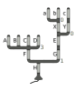
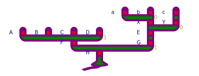

# PlotTree.jl
Plot trees to svg.

Looks like this:


## 1. Specify the tree structure in nested tuples 

```julia
tree = ([
    ([
        ([],0,"A"),
        ([],0,"B"),
        ([],0,"C"),
        ([],0,"D")
    ], 3, "F"),
    ([
        ([
            ([([],0,"a"),([],0,"b")],0,"X"),
            ([([],0,"c")],1,"Y"),
        ],0,"E")
    ], 1, "G")
], 1, "H")
```

Here, each tuple is of the form `(children::Vector, threshold::Real, label::Union{String,Nothing})`.

## 2. Define the plot configuration

```julia
cfg = TreePlotCfg(
        segment_height=10,
        segment_width=10,
        text_width=20,
        connector_height=10,
        segment_color="red",
        connector_color="green",
        label_color="blue",
        threshold_color="orange",
        stroke_color="purple",
        stroke_width=4,
        font_size=10
)
```

## 3. Generate the scene and save or display it

```julia
s = Scene(tree,cfg)
save("test.svg", s)
display("image/svg+xml", s)
```
The results look like this abomination:

