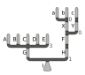
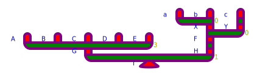

# PlotTree.jl
Plot trees to svg.

Looks like this:


## 1. Specify the tree structure in nested tuples 

```julia
tree = Node([
    Node([
        Node("A"),
        Node("B"),
        Node("C"),
        Node("D"),
        Node("E")
    ], 3, "G"),
    Node([
        Node([
            Node([Node("a"),Node("b")],0,"X"),
            Node([Node("c")],1,"Y"),
        ],0,"F")
    ], 1, "H")
], 1, "I")
```

Here, each tuple is of the form `(children::Vector, threshold::Real, label::Union{String,Nothing})`.

## 2a. Save svg of tree structure

```julia
save("test3.svg", tree;
    scale_mm =3,
    segment_height=10,
    segment_width=10,
    text_width=20,
    connector_height=10,
    segment_color="red",
    connector_color="green",
    label_color="blue",
    threshold_color="orange",
    stroke_color="purple",
    stroke_width=4,
    font_size=10
)
```

The above command overwrites a lot of sensible defaults with nonsense.
The results look like this abomination:


## 2b. Save svg of equation instead

```julia
save("test4.svg", tree; style=:equation)
```

This requires `pdflatex` and `pdf2svg` to be installed and creates temporary files via `tempname` **without cleaning up afterwards**.

The equation is rendered as follows:

